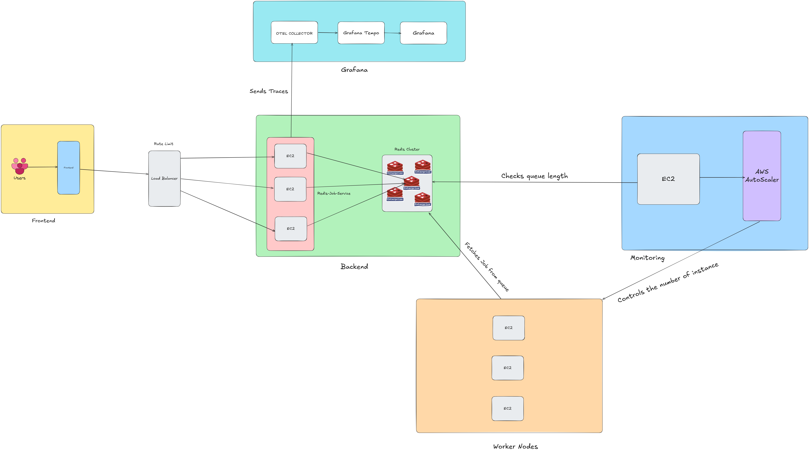

# Backend Documentation for Job Queue System

## Overview

The backend is a core component of the job queue system that handles:

- Job creation, queuing, and prioritization.
- Job processing, cancellation, and monitoring.
- Interaction with Redis for queue and metadata management.

The backend also includes APIs to manage and monitor the system and integrates a monitoring script for auto-scaling workers.

---

## Architecture



### Components

1. **Redis**:
   - Used as the primary queue for jobs.
   - Stores job metadata, dependencies, and statuses.
2. **Express.js Server**:
   - Provides RESTful APIs for job management and monitoring.
   - Serves as the backend for the frontend dashboard.
3. **Monitoring Script**:
   - Dynamically scales worker EC2 instances based on Redis queue length.
4. **Worker Script**:
   - Processes jobs from the Redis queue.
   - Manages job dependencies and retries.
5. **Frontend Repository**:
   - Contains the React application built with Vite and styled using Tailwind CSS.
   - Provides a user-friendly dashboard for monitoring job statuses and worker health
   - [You can go to the repository from here](https://github.com/Safin-Ahmed/redis-job-frontend)
6. **Infra Folder**
   - Contains Pulumi scripts for setting up and managing AWS infrastructure
7. **Otel-Grafana Folder**
   - Contains docker compose and necessary config file to setup the monitor and logging infra

### Key Functionalities

- **Job Prioritization**:
  - Jobs are queued into `high_priority_jobs` or `normal_jobs` based on their priority.
- **Job Dependencies**:
  - Jobs can depend on other jobs, ensuring that dependent jobs are processed only after their prerequisites are complete.
- **Job Progress Tracking**
  - Individual job can be tracked by a progress bar to see the completion status
- **Dead Letter Queue**
  - Failed jobs will be moved to a separate dead letter queue
- **Job Cancellation**
  - Individual job can be cancelled in pending state or in progress state.
- **Auto-Scaling**:
  - Automatically adjusts the number of worker instances based on the queue length.
- **Handle Job Failures and Retry Mechanism**
  - Automatically handles failures gracefully and retries upto 3 times before it moves the job to dead-letter queue
- **User Friendly Dashboard to Monitor Job Status and Worker Health**
  - Dashboard provided in frontend repo to monitor job status and worker health in realtime.
- **Logging and Monitoring Through OpenTelemetry and Grafana**
  - The backend application generates traces for the whole application and it can be visualized in grafana dashboard

---

## API Endpoints

### 1. Enqueue Job

**Endpoint**: `POST /api/jobs`

**Description**: Adds a job to the appropriate queue based on priority.

**Request Body**:

```json
{
  "type": "example",
  "data": { "key": "value" },
  "priority": "high",
  "dependencies": ["job:1234", "job:5678"]
}
```

**Response**:

```json
{
  "type": "example",
  "data": { "key": "value" },
  "priority": "high",
  "dependencies": ["job:1234", "job:5678"]
}
```

### 2. Get Job Status

Endpoint: GET /api/jobs/:jobId
Description: Fetches the status and metadata of specific job.

**Response**:

```json
{
  "success": true,
  "job": {
    "status": "PENDING",
    "type": "example",
    "data": "{\"key\": \"value\"}",
    "retries": "0",
    "progress": "0",
    "created_at": "timestamp"
  }
}
```

### 3. Get All Jobs

Endpoint: GET /api/jobs
Description: Fetches all jobs along with metadata.

**Response**:

```json
{
    "success": true,
    "job": [
        {"jobId": "job:abcd1234", "status": "PENDING", ...},
        {"jobId": "job:wxyz5123", "status": "COMPLETED"}
    ]
}
```

### 4. Cancel Job

Endpoint: POST /api/jobs/:jobId/cancel
Description: Cancels a specific job if it is in PENDING or PROCESSING state.

**Response**:

```json
{
  "success": true,
  "message": "Job Cancelled"
}
```

### 5. Delete Job

Endpoint: DELETE /api/jobs/:jobId
Description: Deletes a specific job and it's associated metadata.

**Response**:

```json
{
  "success": true,
  "message": "Job deleted successfully"
}
```

### 6. Get Job Stats

Endpoint: GET /api/jobs/stats
Description: Fetches job statistics (e.g., counts of jobs in various states).

**Response**:

```json
{
  "success": true,
  "stats": {
    "PENDING": 10,
    "PROCESSING": 5,
    "COMPLETED": 20,
    "FAILED": 3
  }
}
```

<br />

# Job States

The following states represent the lifecycle of a job:

- <code style="color: white">PENDING</code>: The job is waiting in the queue to be processed.
- <code style="color: white">PROCESSING</code>: The job is being processed by a worker.
- <code style="color: white">COMPLETED</code>: The job has been successfully processed.
- <code style="color: white">FAILED</code>: The job processing failed.
- <code style="color: white">CANCELLED</code>: The job was cancelled before completion.

 <br />

# Monitoring Script

**Purpose**: Automatically scales worker EC2 instances based on Redis queue length.

### Key Features

- Fetches queue length from high_priority_jobs and normal_jobs.
- Scales up workers when queue length exceeds the threshold.
- Scales down workers when the queue length is low and workers are idle.

### Script Execution

1. Start Monitoring
   ```
   node monitor.js
   ```
2. Logs
   - Monitor logs for scaling actions and queue statistics.

### Example Logs

```
Queue Length: 75 (High Priority: 50, Normal: 25)
Scaling up by 3 instances...
Launched instances: i-0abcd1234, i-0efgh5678
```

# Worker Script

### Purpose

The worker script is responsible for fetching jobs from the Redis queue, processing them, and updating their status. It ensures job are handled one at a time, respects job dependencies, and retries jobs in case of failures.

### Key Features

1. Handles Prioritization
   - Processes jobs from high_priority_jobs first, followed by normal_jobs.
2. Dependency Management
   - Ensures all dependencies are completed before processing a job.
3. Retry Mechanism
   - Retries jobs upto 3 times in case of failures.
4. Status Updates:
   - Updates job status in Redis (PENDING, PROCESSING, COMPLETED, FAILED)
5. Dependents Notification:
   - Notifies dependent jobs when a dependency is completed

# Worker Script Code

```js
const redis = require("./redisClient");
const { v4: uuidv4 } = require("uuid");

const workerId = `worker:${uuidv4()}`;
const queueName = process.argv[2] || "normal_jobs";

// FUNCTION TO UPDATE JOB PROGRESS
async function updateJobProgress(jobId, progress) {
  try {
    console.log({ jobId, progress });
    await redis.hset(jobId, "progress", progress.toString());
    console.log(`Job ${jobId} progress updated to ${progress}%`);
  } catch (error) {
    console.error(`Error updating job progress: ${error}`);
  }
}

async function isJobCancelled(jobId) {
  const jobDetails = await redis.hgetall(jobId);
  return jobDetails.status === "CANCELLED";
}

// FUNCTION TO PROCESS A SINGLE JOB
async function processJob(queueName) {
  const jobId = await redis.brpop(queueName, 0);
  if (jobId) {
    const jobKey = jobId[1];
    console.log(`Retrieved Job: ${jobKey}`);

    // Fetch the job details from Redis
    const jobDetails = await redis.hgetall(jobKey);

    // Check Dependencies of the Job
    const dependencies = await redis.smembers(`${jobKey}:dependencies`);

    if (dependencies.length > 0) {
      console.log(`Job ${jobKey} is waiting for dependencies: `, dependencies);
      await redis.lpush(queueName, jobKey);
      return;
    }

    // Check if the job is cancelled
    if (jobDetails.status === "CANCELLED") {
      console.log(`Job ${jobKey} is cancelled. Skipping.`);
      return;
    }

    await redis.hset(jobKey, "status", "PROCESSING");

    try {
      console.log(`Processing Job: ${jobKey}`);

      // Simulate job progress in steps
      for (let progress = 0; progress <= 100; progress += 10) {
        // Check if the job is cancelled mid progress
        if (await isJobCancelled(jobKey)) {
          console.log(`Job ${jobKey} cancelled mid-progress. Stopping.`);
          await redis.hset(jobKey, "status", "CANCELLED");
          return;
        }

        await updateJobProgress(jobKey, progress);
        await new Promise((resolve) => setTimeout(resolve, 1000));
      }

      await redis.hset(jobKey, {
        status: "COMPLETED",
        result: `Success Result of Job ${jobKey} `,
      });

      // Notify dependent jobs
      const dependents = await redis.smembers(`${jobKey}:dependents`);
      for (const dependent of dependents) {
        await redis.srem(`${dependent}:dependencies`, jobKey);
        console.log(`Notified dependent job ${dependent}`);
      }
    } catch (error) {
      console.error(`Job ${jobKey} failed: `, error);
      const retries = await redis.hincrby(jobKey, "retries", 1);

      if (retries >= 3) {
        await redis.hset(jobKey, "status", "FAILED");
        await redis.lpush("dead_letter_queue", jobKey);
        console.log(`Job ${jobKey} moved to dead letter queue`);
      } else {
        console.log(`Retrying job ${jobKey}`);
        await redis.lpush(queueName, jobKey);
      }
    }
  }
}

// FUNCTION TO SEND WORKER HEARTBEAT
async function sendHeartbeat() {
  try {
    await redis.hmset(workerId, {
      status: "ALIVE",
      queue: queueName,
      last_seen: Date.now(),
    });
    // AUTO EXPIRE WORKER KEY AFTER 10 SECONDS IF NO HEARTBEAT
    await redis.expire(workerId, 10);
    console.log(`Heartbeat sent for ${workerId}`);
  } catch (error) {
    console.error(`Error sending heartbeat: ${error}`);
  }
}

// Periodically send heartbeats every 5 seconds
setInterval(sendHeartbeat, 5000);

// Worker Execution
(async () => {
  console.log(`Worker listening on queue: ${queueName}`);

  while (true) {
    await processJob(queueName);
  }
})();
```

<br />

# Configuration

### Environment Variables

- REDIS_HOST: The Redis server host
- REDIS_PORT: The Redis server port
- AWS_REGION: The AWS region for worker scaling.
- LAUNCH_TEMPLATE_ID: The ID of the launch template for worker instances.
